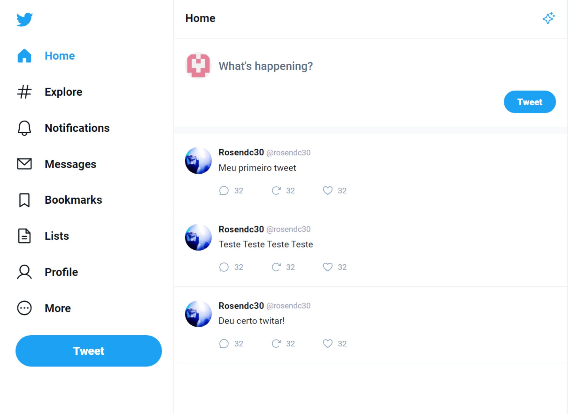

## Desafio 28 #BoraCoda - Plataforma de IA

## :dart:  Desafio

Projeto MasterClass da Rocketseat, consiste em reconstruir o tweeter 

## :nut_and_bolt: Tech

* REACT
* Use States
* TypeScript
* react-router-dom
* phosphor-react
* VITE
* STYLED-COMPONENTS 

## :mailbox_closed: Contatos

> Email - rosendc30@gmail.com

> Linkedin - https://www.linkedin.com/in/francisco-rosendo-coelho/